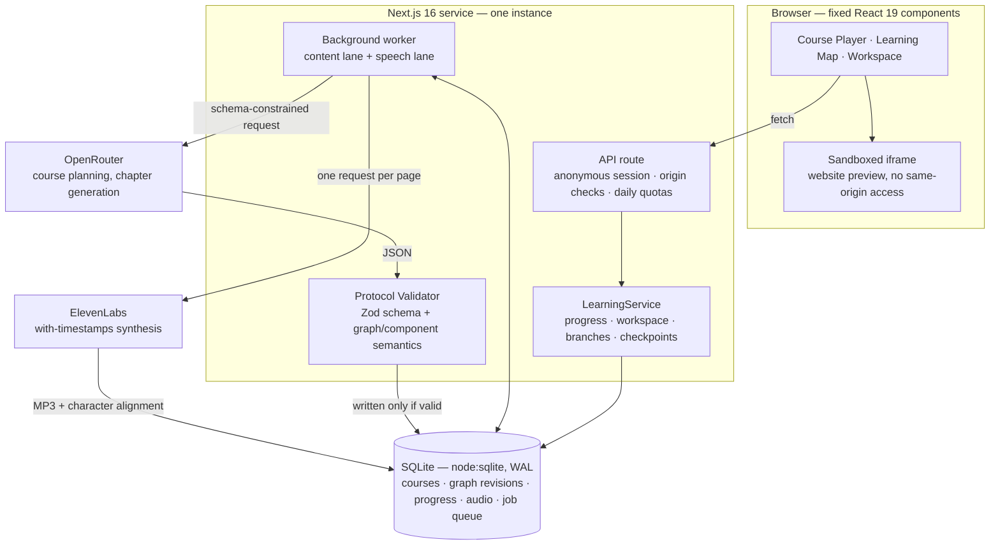

# Methelia

**English** | [繁體中文](README.zh-TW.md)

Type one sentence — _"I want to build my own personal website"_ — and Methelia plans a course for it: a dependency graph of short lessons, each chapter generated whole just before you reach it, narrated page by page, with exercises the server actually checks before it lets you continue.

The interesting constraint is what the model is _not_ allowed to do. **It never writes a line of interface code.**

## Problem and goals

Two kinds of learning material exist today and neither fits someone with a specific goal.

Recorded courses are fixed. Somebody chose the syllabus two years ago and you either wanted exactly that or you didn't. Chatbots are the opposite — they will answer anything, but what comes back is a wall of text: no ordering, nothing to do with your hands, and nobody checking whether it landed. You read an explanation of CSS specificity, nod, close the tab, and have learned nothing.

The tempting fix is to let the model generate the lesson interface too. That trades one problem for a worse one. Every lesson becomes a pile of untested markup, the "terminal" is a prop, the exercise checker is whatever the model felt like emitting that day, and you have shipped arbitrary code execution inside a homework app.

Methelia splits it the other way: **the model plans and writes, and never renders.** It emits structured JSON — first a Course Graph of learning nodes with real prerequisites, then one complete chapter at a time containing sections, worked examples, quiz items, checkpoint conditions and a narration script. Everything a learner touches — editor, terminal, preview, map, player — is fixed React that we wrote and tested. Whether an exercise passed is decided by the backend inspecting the saved filesystem, never by the model or the browser claiming success.

That is the whole bet: content can be about anything, while practice stays verifiable and execution stays bounded.

## Core features

- **A goal becomes a graph, not a playlist.** The planner emits learning nodes with prerequisites and an ordered route. The Learning Map draws it, opens fullscreen, pans and zooms, and lets you re-enter any finished node without losing your position in the course.
- **Chapters are generated whole, just in time.** A chapter is never streamed at you sentence by sentence while you read. Every page, example, checkpoint and line of narration is generated and validated before you see page one, and stays immutable while you work through it.
- **Narration is aligned, not estimated.** Each page goes to ElevenLabs as one with-timestamps request, and short subtitles are cut from the returned character alignment. When alignment and text disagree we show an error rather than invent timings. Playback stops at the end of a page instead of dragging you forward.
- **The workspace matches the activity.** New website lessons open an editor and live preview directly; Python lessons use a real in-browser Pyodide runtime; terminal lessons operate on virtual files. Concept lessons need no code workspace. The existing website demo retains its teaching terminal. Files persist in SQLite and can be exported as a ZIP.
- **The teacher demonstrates without doing your homework.** A demonstration section replays a pre-validated find/replace against an isolated copy of the files and shows the result. Your own work is untouched, and the exercise that follows is still yours to do.
- **Checkpoints are server-side.** `file.includes`, `file.exists`, `directory.exists`, `cwd.equals`, or a quiz answer — every one is evaluated in the backend against saved state. A client that POSTs "I finished" gets nothing.
- **Ask a question, get a detour.** The help drawer can propose support nodes for a gap you just hit. You see what they cover and where they rejoin before anything changes; approving one forks the graph into a new immutable revision instead of overwriting your route.

## System architecture



The whole system is one Next.js process and one background worker, started together by `concurrently -k` and sharing a single SQLite file. No Redis, no Postgres, no queue service, no second machine — the job queue is a table. That keeps the deployment to one paid instance with one disk to back up, and means `npm run dev` gives you the entire stack on a laptop.

Five things are worth knowing about how the pieces fit:

**Nothing expensive happens inside a request.** An HTTP handler validates, writes, and enqueues. Planning a course and synthesizing narration take tens of seconds, so they run in the worker and the UI polls. A dropped connection never loses generated work.

**The validator is the only door.** Model output is parsed by a Zod schema and then run through semantic rules in [`src/core/protocol.ts`](src/core/protocol.ts): the graph must be acyclic and fully reachable, prerequisites must actually precede their node, a component must be legal for the template it sits in, a practice section must carry a verifiable checkpoint, a guided edit's `find` string must genuinely occur in the file it claims to edit, and every terminal command must be one the runtime can execute. Failing output is sent back for repair, at most twice, and never reaches a learner half-valid.

**Two lanes, one queue.** Content generation and speech synthesis pull from the same `generation_jobs` table on separate lanes, so a slow TTS call never blocks the next chapter from being prepared. Each job takes a 240-second lease with a 30-second heartbeat, so a worker killed mid-job releases its work instead of parking it forever.

**Late writes lose.** Every commit re-checks, inside its own transaction, that the chapter it is writing is still the live version of that course. A learner can delete a course or rebuild its narration while a provider request is still in flight; when the response finally lands it is discarded rather than resurrecting deleted data. This is the case the [deletion tests](tests/worker-deletion.test.ts) exist for.

**The learner's code runs nowhere near the host.** The website preview is a sandboxed iframe with no same-origin access and a CSP that blocks external loads. The terminal is not a shell — it is an interpreter over a virtual filesystem stored in the database.

Roughly 8,000 lines of TypeScript, and about the same again in tests.

## Tech stack

| Category     | Technology / service                                       | Purpose                                                                 |
| ------------ | ---------------------------------------------------------- | ----------------------------------------------------------------------- |
| AI model     | OpenRouter · `z-ai/glm-5.3-flash`                          | Plans the Course Graph and generates whole Chapter Packages as JSON     |
| Frontend     | Next.js 16 (App Router), React 19, TypeScript 7            | Course player, Learning Map, workspace, and every other fixed component |
| Backend      | Next.js Route Handler (Node.js 22), Zod 4                  | API, anonymous sessions, protocol validation, checkpoint evaluation     |
| Backend      | Custom background worker (tsx + concurrently)              | Durable generation queue with separate content and speech lanes         |
| Database     | `node:sqlite` (WAL)                                        | Courses, graph revisions, progress, workspace, audio, daily usage       |
| Sponsor tech | **ElevenLabs** (`eleven_multilingual_v2`, with-timestamps) | Per-page synthesis and character-level subtitle alignment               |
| Deployment   | Render Blueprint + persistent disk                         | One service running both the website and the worker                     |
| Testing      | Vitest 5, Playwright                                       | Core, service and worker unit tests plus browser regression tests       |

## Setup and running

Needs **Node.js 22.17 or newer** — SQLite comes from Node's built-in `node:sqlite`, which prints an experimental warning on this version.

```bash
git clone https://github.com/Jack-hehe/methelia.git
cd methelia
git switch feat/methelia-mvp-release
npm ci

# Fill in AI_BASE_URL / AI_MODEL / AI_API_KEY and
# ELEVENLABS_API_KEY / ELEVENLABS_VOICE_ID
cp .env.example .env.local

# Starts Next.js and the background worker together; Ctrl+C stops both
npm run dev
```

Open <http://127.0.0.1:3000>. **You do not need an API key to try it** — "Try a Lesson" opens a pre-built demo course. Credentials are only needed to generate new courses and narration.

```bash
npm test && npm run typecheck && npm run build
npx playwright install chromium && npm run test:e2e
```

On Windows PowerShell use `npm.cmd`/`npx.cmd` and `Copy-Item .env.example .env.local`. Credential setup, narration rules and Render deployment live in [docs/operations.md](docs/operations.md).

## Demo

- Live demo: _to be added_ (Render, behind HTTP Basic; username `demo`)
- Judging video: _to be added_

## Limitations and future work

Written down here so nobody has to discover them during a demo.

- **The terminal is a teaching surface with real state, not a shell.** `pwd`, `ls`, `cd`, `mkdir`, `touch`, `cat` and `clear` operate on a persisted virtual filesystem. No flags, pipes, redirection, package installs or processes. `python -m http.server 8000` is wired to the preview and does not run Python.
- **The preview sandbox has no resource quota.** The iframe has no same-origin access and CSP blocks external loads, but nothing stops a `while (true)`. Don't expose this build as a public code runner.
- **No accounts.** A session is a cookie. Clear it and those courses are unreachable; there is no recovery path yet.
- **One route, not a scheduler.** Support nodes splice into a single main path. Arbitrary multi-branch curricula are not implemented.
- **Narration syncs at section granularity.** The guided cursor inside a section advances on fixed relative progress, not word-level semantics, and there is no teacher avatar or lip sync.
- **Passing tests is not passing content.** The demo course is covered end to end. That says nothing about whether a freshly generated chapter on an arbitrary topic is pedagogically sound — a human still has to read it.
- **Daily caps count requests, not dollars.** 100 AI requests and 30,000 synthesized characters per UTC day, counted atomically in SQLite. Providers still bill by model and token.

Next, roughly in order:

- **Subject independence.** Scope confirmation, four learning environments (`none`, `web`, `python`, `terminal`), and separate content/speech lanes are connected. See the [validation record and capability limits](docs/general-learning-validation.md). Handouts currently have an HTML renderer but no export entry point. The [architecture design](docs/superpowers/specs/2026-09-05-general-learning-architecture-design.md) describes the broader roadmap.
- Accounts and cross-device progress sync.
- Word-level alignment for the guided cursor, so the demonstration follows the sentence rather than the clock.
- Multi-branch scheduling, and stricter acceptance checks on generated chapters.

## Third-party services, data, and assets

| Item                | Source                                                                                                 | Usage and license                                                                                                                             |
| ------------------- | ------------------------------------------------------------------------------------------------------ | --------------------------------------------------------------------------------------------------------------------------------------------- |
| ElevenLabs TTS      | [with-timestamps API](https://elevenlabs.io/docs/api-reference/text-to-speech/convert-with-timestamps) | Called under the account's subscription for per-page narration and subtitles; keys live only in `.env.local` and Render environment variables |
| OpenRouter          | <https://openrouter.ai>                                                                                | Model gateway, used under its terms and each provider's rules                                                                                 |
| Next.js / React     | <https://nextjs.org> · <https://react.dev>                                                             | MIT                                                                                                                                           |
| Zod                 | <https://zod.dev>                                                                                      | MIT                                                                                                                                           |
| lucide-react        | <https://lucide.dev>                                                                                   | ISC                                                                                                                                           |
| fflate              | <https://github.com/101arrowz/fflate>                                                                  | MIT — ZIP export of learner work                                                                                                              |
| Vitest / Playwright | <https://vitest.dev> · <https://playwright.dev>                                                        | MIT / Apache-2.0, development dependencies only                                                                                               |
| Render              | <https://render.com>                                                                                   | Paid web service and persistent disk, under its terms                                                                                         |
| Course content      | Generated by the model at runtime                                                                      | No external courseware dataset or copyrighted course material is used                                                                         |
| Fonts               | System fonts (`system-ui`, Noto Sans TC and similar)                                                   | No third-party font files embedded or redistributed                                                                                           |
| Audio               | Narration synthesized by ElevenLabs; tests use a silent WAV built for this project                     | No third-party recordings are used                                                                                                            |

No credentials or personal data are committed. `.env.local`, `.data/` and test output are all in `.gitignore`, and `.env.example` holds empty placeholders only.

## Team

| Name     | Role          |
| -------- | ------------- |
| Jack     | _to be added_ |
| Casanova | _to be added_ |

## License

MIT. See [LICENSE](LICENSE).
