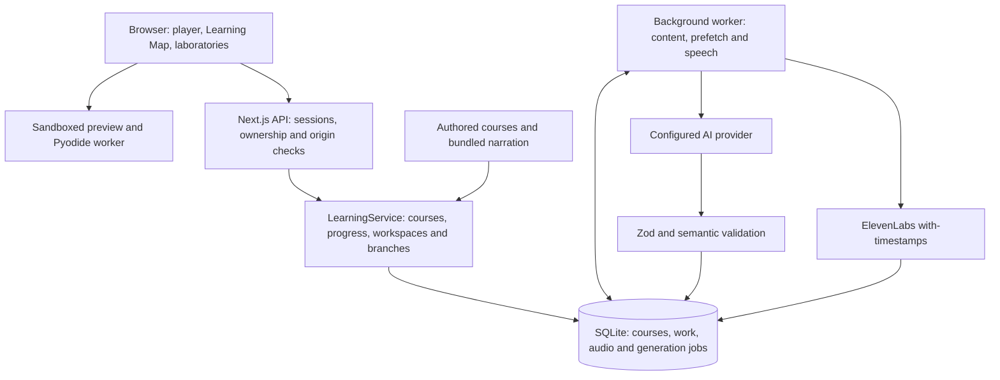

# Methelia

**English** | [繁體中文](README.zh-TW.md) · **[Open Methelia](https://methelia.com)**

Watching a tutorial is not the same as being able to build the thing. Methelia turns a learning goal into a guided course where every chapter pairs a short explanation with a model you can manipulate, something you actually build, and a checkpoint that tests whether the idea landed. Start from a ready-made project, or describe what you want to learn and get a course built for it.

It is written for students teaching themselves programming and science, and for teachers who want a ready-made project to run a class from. The goal is to turn "I watched the whole thing and still can't build it" into "I built it, and I can explain why it works."

Open to everyone, with no account and no shared password. Courses and saved work live on the server, and a browser cookie identifies each learner.

## Core features

- 20 featured project courses, five chapters each, in English and Traditional Chinese, with all 200 chapter narrations prepared in advance.
- Describe what you want to learn and get a personalized course and Learning Map, with later chapters adjusted from how you did on earlier checkpoints.
- 17 reusable interactive laboratories across mathematics, physics, chemistry, biology, economics and logic.
- A Python runtime and a web editor with sandboxed preview, both in the browser; finished work downloads as a ZIP.
- Checkpoints verify the work and code you actually saved, not just multiple-choice answers.

## Demo

- Live site: <https://methelia.com>
- Judging video: <https://youtu.be/3ka7kQrFlDg>

## Technology

| Category         | Technology or service                                       | Purpose                                                  |
| ---------------- | ----------------------------------------------------------- | -------------------------------------------------------- |
| AI model         | ChatGPT (`openai/gpt-5.6-luna`) through OpenRouter          | Generates course graphs, chapter content and checkpoints |
| Sponsor          | **ElevenLabs** (`eleven_v3`, with-timestamps)               | Narration, plus caption and page-boundary alignment      |
| Frontend         | Next.js 16 App Router, React 19, TypeScript 7, Lucide icons | Player, Learning Map and laboratory interfaces           |
| Backend          | Node.js 22, Zod 4, built-in `node:sqlite` in WAL mode       | API, content validation, job queue and persistence       |
| Learner runtimes | Pyodide 0.28.3, sandboxed iframe preview, fflate            | In-browser Python, web workspace and ZIP export          |
| Hosting          | Render web service with a persistent disk                   | Website and background worker on one instance            |
| Development      | Claude Code                                                 | Building and reviewing the codebase                      |
| Verification     | Vitest, Playwright                                          | Unit tests and browser flow tests                        |

[render.yaml](render.yaml) deploys `main` to a single Render service; see [operations](docs/operations.md) for setup, backups and usage limits.

## Run locally

Use **Node.js 22.17 or newer**. Node 22 may print an experimental warning for its built-in SQLite module.

```bash
git clone https://github.com/Jack-hehe/methelia.git
cd methelia
npm ci
cp .env.example .env.local
npm run dev
```

Open [http://127.0.0.1:3000](http://127.0.0.1:3000). On PowerShell, use `Copy-Item .env.example .env.local`; use `npm.cmd` if execution policy blocks `npm.ps1`.

**Featured course content and the starter lesson work without provider API keys.** For personalized generation, set `AI_BASE_URL`, `AI_MODEL` and `AI_API_KEY` in `.env.local`. Use an OpenAI-compatible endpoint such as OpenRouter's `https://openrouter.ai/api/v1` and a model supporting the structured output expected by the application.

For new narration, set `ELEVENLABS_API_KEY`, `ELEVENLABS_VOICE_ID` and `ELEVENLABS_MODEL`. The example environment defaults to `eleven_flash_v2_5`; deployed starter and featured assets use `eleven_v3`. A bundled audio cache hit requires the matching voice/model/language profile, but no synthesis key. Changing that profile requires preparing new audio. The hosted website already has the matching configuration.

```bash
# Production application, locally
npm run build
npm start
```

Data defaults to `.data/`; `METHELIA_DATA_DIR` overrides it. Python initialization and Google Fonts require network access. Keep credentials in `.env.local`, which is ignored by Git.

## Architecture

The model selects supported components and supplies structured course content, examples and checkpoint conditions. React components implement the learning interface. Generated website examples can contain HTML, CSS and JavaScript, but run in the preview sandbox rather than becoming application UI code.



Next.js and a background worker run together through `concurrently -k`, sharing SQLite in WAL mode. Graph, chapter and narration jobs are persisted in the database. Content, prefetch and speech work are scheduled separately. Intake questions and some assistance requests call the model through API handlers, so those interactions still depend on provider latency.

Generated packages pass schema and semantic validation before use. Graphs, prerequisites, component parameters and declared checkpoints are checked; invalid model output can receive up to two repair attempts. Worker writes recheck that the course and package are still current. Provider failures are surfaced for retry; interrupted external requests can have uncertain billing outcomes.

## Project Structure

```text
methelia/
├── src/
│   ├── app/                         # Next.js pages, layouts and API routes
│   │   ├── api/[...path]/route.ts   # Course, session, progress and workspace API
│   │   ├── api/health/route.ts      # Deployment health check
│   │   └── explore/page.tsx         # Course catalog page
│   ├── components/                  # Player, Learning Map, intake and workspaces
│   │   └── labs/                    # Reusable interactive learning laboratories
│   ├── core/                        # Course schemas, state and learning logic
│   │   ├── featured/                # Authored featured courses and references
│   │   ├── labs/                    # Simulation models and experiment logic
│   │   └── starter-teaching.ts      # Bilingual starter teaching copy and scripts
│   ├── server/                      # Persistence, providers and orchestration
│   │   ├── service.ts               # Course lifecycle, progress and workspaces
│   │   ├── worker.ts                # Background content and speech jobs
│   │   ├── db.ts                    # SQLite schema and storage
│   │   └── speech.ts                # ElevenLabs synthesis and alignment validation
│   └── proxy.ts                     # Optional private access gate
├── public/
│   ├── featured-audio/              # Prepared featured MP3s and caption/page timing
│   └── starter-audio/               # Prepared starter MP3s and caption/page timing
├── scripts/                         # Prepare, inspect and verify narration assets
├── tests/                           # Vitest unit tests and Playwright browser tests
│   └── fixtures/                    # Test courses, provider substitutes and servers
├── docs/                            # Teaching contracts, operations and release records
│   └── course-scripts/              # Reviewed starter narration in both languages
├── .env.example                     # Local environment configuration template
├── next.config.ts                   # Next.js build configuration
├── render.yaml                      # Render service, disk and environment settings
└── package.json                     # Dependencies and development commands
```

To change starter teaching content, begin with [starter-teaching.ts](src/core/starter-teaching.ts) and its [reviewed scripts](docs/course-scripts). Learning components live in [src/components/labs](src/components/labs), with their model logic in [src/core/labs](src/core/labs). Local runtime data in `.data/` and build output in `.next/` are generated and ignored by Git.

## Verify changes

```bash
npm test
npm run build
npx playwright install chromium
```

For isolated browser acceptance tests, first build the dedicated output:

```bash
# macOS / Linux
METHELIA_TEST_BUILD=1 npm run build
npx playwright test --config playwright.general.config.ts
```

```powershell
# PowerShell
$env:METHELIA_TEST_BUILD = '1'
npm run build
Remove-Item Env:METHELIA_TEST_BUILD
npx playwright test --config playwright.general.config.ts
```

This configuration uses a temporary database, a deterministic local model substitute and port 3100. It exercises the real API, worker and browser runtime. The default `npm run test:e2e` instead starts or reuses the development server on port 3000; some isolated-server cases are skipped there.

The featured release passed 294 unit tests and 59 selected browser cases on 2026-09-06. All 200 MP3s passed decoding and caption/page timing checks. Subsequent public-access checks verified anonymous enrollment and isolation between visitors. These are dated results, not a guarantee of arbitrary generated content quality. See the [verification record and narration preparation commands](docs/featured-courses-release.md); generation can consume provider credits.

The revised starter release also passed 87 focused unit tests, 28 selected existing browser cases and two new bilingual element-inspection cases. All ten starter MP3s passed decoding and timing checks. Both language routes were verified on the deployed site, including cached playback, page-boundary pauses, practice completion and ZIP export. See the [starter release record](docs/starter-course-release.md).

## Limitations and future work

- There is no account system. A learner is a browser cookie, so clearing site data loses their courses and nothing follows them to another device. Sign-in with cross-device progress is what we want next.
- Every course is five chapters, in English or Traditional Chinese, and the catalog has no search. More projects, more languages and real search are planned.
- A course is either written by us or generated from a goal you type. We want to build one from your own material too — a video, a PDF or a slide deck.
- Checkpoints are multiple-choice questions and file checks. They cannot tell whether code is written well, or whether an explanation in your own words makes sense; written answers with model feedback are planned.
- Teacher-authored courses, classroom roles and assignments do not exist yet.
- The terminal runs a bounded command set rather than a host shell, Python runs in the browser, and the laboratories expose fixed parameters rather than solving arbitrary equations.
- One Render service and its worker share a single SQLite file, and the whole site shares 100 AI requests and 30,000 synthesized characters a day.

## Sources and attribution

- Authored featured courses and simplified models live in [src/core/featured](src/core/featured) and [src/core/labs](src/core/labs). Their [references](src/core/featured/references.ts) point to primary documentation and open textbooks. Personalized course content is generated at runtime.
- ElevenLabs supplies synthesized narration; OpenRouter provides the configured model gateway. Provider terms apply to their services and generated outputs.
- Pyodide assets are fetched from jsDelivr. DM Sans and Noto Sans TC are loaded through Google Fonts with system fallbacks; they are not bundled font files.
- Dependencies retain their own licenses. The repository's MIT license does not replace third-party licenses or service terms.

## Team and license

Built by **Jack** and **Casanova**. Repository code is licensed under [MIT](LICENSE).
