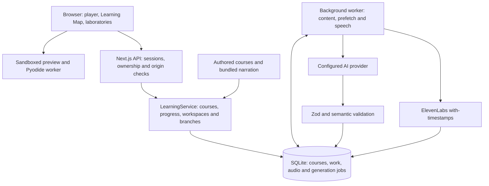

# Methelia

**English** | [繁體中文](README.zh-TW.md) · **[Open Methelia](https://methelia.com)**

Methelia turns a learning goal into a guided course built around understanding and making things. Short explanations connect to visual models, animations, experiments, coding activities and checkpoints. Start with a ready-made project or describe what you want to learn and build a personalized path.

The website is open to everyone without an account or shared password. Courses and saved work are stored on the server; a browser cookie identifies each anonymous learner. Account login and cross-device progress recovery are not implemented yet.

## Learning experience

1. **Choose a project or describe a goal.** Personalized courses ask topic-aware questions about experience, interests and depth, one at a time. Supported questions allow multiple selections or skipping, and creation can be cancelled.
2. **Review the Learning Map.** Nodes describe concepts, prerequisites and outcomes. Personalized chapters are prepared incrementally; featured projects have all five authored chapters ready immediately.
3. **Learn by doing.** Read a concise explanation, manipulate a visual model, watch a demonstration, or work in the appropriate editor.
4. **Check understanding and adapt.** Quizzes and saved-work checkpoints provide feedback. Personalized routes use learning results when preparing subsequent chapters. Extension units branch from a selected node and let learners return to the main course.

### Starter website course

“Try a lesson” opens **Build an interactive personal homepage with HTML, CSS and JavaScript**: five chapters covering language roles, an HTML heading, CSS button styling, a JavaScript click handler, and exporting the finished files. Teacher narration includes explanations, demonstrations and practice guidance. Its ten bilingual chapter audio files are bundled (approximately 33 minutes across both languages); opening the starter never automatically purchases missing narration. See the [reviewed scripts and verification record](docs/starter-course-release.md).

### Featured projects

**20 projects × 5 chapters**, in **English and Traditional Chinese**: 100 chapters and 200 localized chapter packages. All 200 chapter narration files are prepared, with approximately 154 minutes of audio.

| Area                      | Projects                                                                                    |
| ------------------------- | ------------------------------------------------------------------------------------------- |
| Web, Python and computing | Interactive portfolio; Python data website; text adventure; CSV data story; maze pathfinder |
| Mathematics               | 2D/3D equation explorer; smooth coaster and derivatives; probability game                   |
| Physics and sound         | Collision level; satellite mission; adjustable lamp; mini synthesizer                       |
| Visual design             | Color tool; hierarchy poster; bouncing character                                            |
| Science and environment   | Small ecosystem; particle separation; rain-ready neighborhood                               |
| Economics and logic       | Coffee shop simulation; digital logic door                                                  |

Each project connects background and purpose to a working model or program, an experiment and an explanation checkpoint. The **17 reusable laboratories** retain learner parameters and support demonstrations, resets and experiment exports. Three coding courses produce working code or downloadable files.

See the [course release guide](docs/featured-courses-release.md), [component contracts and model limits](docs/teaching-components.md), and [per-course references](src/core/featured/references.ts).

### Playback and practice

- **One audio file per chapter.** ElevenLabs character alignment supplies captions and page boundaries. Playback pauses at page boundaries; manually choosing the next page or chapter starts playback automatically. Legacy page-based audio remains supported.
- **Independent captions.** Captions overlay the lesson. Idle playback controls hide while captions remain visible with bottom spacing.
- **Reusable Python runtime.** Pyodide runs Python in a browser worker and is reused while the learning interface remains mounted. Generated text files can be previewed and downloaded as a ZIP.
- **Activity-specific workspaces.** Website lessons use an editor and sandboxed preview. Terminal lessons operate on a persisted virtual filesystem. Pure concept lessons need no programming workspace.
- **Bounded demonstrations and checks.** Demonstrations use an isolated view of learner work or temporary lab controls. The server checks quiz answers and declared filesystem conditions against saved state; these checks do not prove arbitrary program correctness.

## Architecture

The model selects supported components and supplies structured course content, examples and checkpoint conditions. React components implement the learning interface. Generated website examples can contain HTML, CSS and JavaScript, but run in the preview sandbox rather than becoming application UI code.



Next.js and a background worker run together through `concurrently -k`, sharing SQLite in WAL mode. Graph, chapter and narration jobs are persisted in the database. Content, prefetch and speech work are scheduled separately. Intake questions and some assistance requests call the model through API handlers, so those interactions still depend on provider latency.

Generated packages pass schema and semantic validation before use. Graphs, prerequisites, component parameters and declared checkpoints are checked; invalid model output can receive up to two repair attempts. Worker writes recheck that the course and package are still current. Provider failures are surfaced for retry; interrupted external requests can have uncertain billing outcomes.

## Project Structure

```text
methelia/
├── src/
│   ├── app/                         # Next.js pages, layouts and API routes
│   │   ├── api/[...path]/route.ts   # Course, session, progress and workspace API
│   │   ├── api/health/route.ts      # Deployment health check
│   │   └── explore/page.tsx         # Course catalog page
│   ├── components/                  # Player, Learning Map, intake and workspaces
│   │   └── labs/                    # Reusable interactive learning laboratories
│   ├── core/                        # Course schemas, state and learning logic
│   │   ├── featured/                # Authored featured courses and references
│   │   ├── labs/                    # Simulation models and experiment logic
│   │   └── starter-teaching.ts      # Bilingual starter teaching copy and scripts
│   ├── server/                      # Persistence, providers and orchestration
│   │   ├── service.ts               # Course lifecycle, progress and workspaces
│   │   ├── worker.ts                # Background content and speech jobs
│   │   ├── db.ts                    # SQLite schema and storage
│   │   └── speech.ts                # ElevenLabs synthesis and alignment validation
│   └── proxy.ts                     # Optional private access gate
├── public/
│   ├── featured-audio/              # Prepared featured MP3s and caption/page timing
│   └── starter-audio/               # Prepared starter MP3s and caption/page timing
├── scripts/                         # Prepare, inspect and verify narration assets
├── tests/                           # Vitest unit tests and Playwright browser tests
│   └── fixtures/                    # Test courses, provider substitutes and servers
├── docs/                            # Teaching contracts, operations and release records
│   └── course-scripts/              # Reviewed starter narration in both languages
├── .env.example                     # Local environment configuration template
├── next.config.ts                   # Next.js build configuration
├── render.yaml                      # Render service, disk and environment settings
└── package.json                     # Dependencies and development commands
```

To change starter teaching content, begin with [starter-teaching.ts](src/core/starter-teaching.ts) and its [reviewed scripts](docs/course-scripts). Learning components live in [src/components/labs](src/components/labs), with their model logic in [src/core/labs](src/core/labs). Local runtime data in `.data/` and build output in `.next/` are generated and ignored by Git.

## Technology

| Layer           | Implementation                                                                            |
| --------------- | ----------------------------------------------------------------------------------------- |
| Interface       | Next.js 16 App Router, React 19, TypeScript 7, Lucide icons                               |
| Content and API | Zod 4, Node.js 22, configurable OpenAI-compatible AI endpoint; deployment uses OpenRouter |
| Persistence     | Built-in `node:sqlite`, WAL, database-backed job queue                                    |
| Python          | Pyodide 0.28.3, loaded from jsDelivr into a browser worker                                |
| Narration       | ElevenLabs with-timestamps; deployed starter and featured audio use `eleven_v3`           |
| Exports         | fflate ZIP archives; experiment JSON                                                      |
| Hosting         | Render web service and persistent disk, with website and worker on one instance           |
| Verification    | Vitest and Playwright                                                                     |

## Run locally

Use **Node.js 22.17 or newer**. Node 22 may print an experimental warning for its built-in SQLite module.

```bash
git clone https://github.com/Jack-hehe/methelia.git
cd methelia
npm ci
cp .env.example .env.local
npm run dev
```

Open [http://127.0.0.1:3000](http://127.0.0.1:3000). On PowerShell, use `Copy-Item .env.example .env.local`; use `npm.cmd` if execution policy blocks `npm.ps1`.

**Featured course content and the starter lesson work without provider API keys.** For personalized generation, set `AI_BASE_URL`, `AI_MODEL` and `AI_API_KEY` in `.env.local`. Use an OpenAI-compatible endpoint such as OpenRouter's `https://openrouter.ai/api/v1` and a model supporting the structured output expected by the application.

For new narration, set `ELEVENLABS_API_KEY`, `ELEVENLABS_VOICE_ID` and `ELEVENLABS_MODEL`. The example environment defaults to `eleven_flash_v2_5`; deployed starter and featured assets use `eleven_v3`. A bundled audio cache hit requires the matching voice/model/language profile, but no synthesis key. Changing that profile requires preparing new audio. The hosted website already has the matching configuration.

```bash
# Production application, locally
npm run build
npm start
```

Data defaults to `.data/`; `METHELIA_DATA_DIR` overrides it. Python initialization and Google Fonts require network access. Keep credentials in `.env.local`, which is ignored by Git.

## Verify changes

```bash
npm test
npm run build
npx playwright install chromium
```

For isolated browser acceptance tests, first build the dedicated output:

```bash
# macOS / Linux
METHELIA_TEST_BUILD=1 npm run build
npx playwright test --config playwright.general.config.ts
```

```powershell
# PowerShell
$env:METHELIA_TEST_BUILD = '1'
npm run build
Remove-Item Env:METHELIA_TEST_BUILD
npx playwright test --config playwright.general.config.ts
```

This configuration uses a temporary database, a deterministic local model substitute and port 3100. It exercises the real API, worker and browser runtime. The default `npm run test:e2e` instead starts or reuses the development server on port 3000; some isolated-server cases are skipped there.

The featured release passed 294 unit tests and 59 selected browser cases on 2026-09-06. All 200 MP3s passed decoding and caption/page timing checks. Subsequent public-access checks verified anonymous enrollment and isolation between visitors. These are dated results, not a guarantee of arbitrary generated content quality. See the [verification record and narration preparation commands](docs/featured-courses-release.md); generation can consume provider credits.

The revised starter release also passed 87 focused unit tests, 28 selected existing browser cases and two new bilingual element-inspection cases. All ten starter MP3s passed decoding and timing checks. Both language routes were verified on the deployed site, including cached playback, page-boundary pauses, practice completion and ZIP export. See the [starter release record](docs/starter-course-release.md).

## Deployment and boundaries

[render.yaml](render.yaml) deploys `main` to one Render service with a persistent disk. `METHELIA_PUBLIC_ACCESS=true` opens the site without the optional private access gate. Session ownership and configured origin checks remain active. Deploys are manual; configuration changes should be reviewed through Blueprint sync. See [operations](docs/operations.md) for setup, backups and usage settings.

- **Browser identity, no account recovery.** Clearing the identifying cookie loses access to that learner's courses. There is no cross-device login or recovery flow.
- **Teaching runtimes.** The terminal supports a bounded command set, not a host shell. Python runs in the browser; the Python website course generates static HTML and does not host Flask or Django. Preview JavaScript can stall its browser context and has no server-side resource quota.
- **Defined laboratory models.** Simulations expose supported parameters; they are not general equation solvers or engineering analysis tools. Model assumptions are documented with the components.
- **Adaptive paths have limits.** Extension routes and performance-based adjustments exist. Arbitrary curriculum scheduling and fully automatic teaching-quality assessment remain future work.
- **Provider and hosting limits.** New AI content and uncached speech require configured providers. Render sets global UTC-day limits of 100 AI requests and 30,000 synthesized characters. Cached playback does not consume synthesis limits. These are usage counters, not currency limits.

## Limitations and future work

The section above covers what the current runtimes can do. This one is about what Methelia cannot do yet, and what we want to add. None of it has a date.

### Accounts

A learner is just a browser cookie today. There is no sign-up and no password, so clearing site data loses the courses.

- Sign in with an email link or another provider, keeping work started before signing in.
- Pick up a course on another device, and get progress back after clearing a browser.
- Export or delete your own courses and work.
- Teacher and student roles, so a class can be grouped and given a project.

### More courses

There are 20 featured projects and one starter course, each five chapters, in English and Traditional Chinese. The catalog filters by one subject and has no search.

- More projects, in more subjects, and longer ones. The schema already allows up to seven chapters; every published course stops at five.
- Search by title and content, with filters for difficulty and assumed prior knowledge.
- More languages.
- Turn your own material into a course: hand Methelia a video, a PDF, a slide deck or an article, and get chapters, checkpoints and narration built from it. None of this exists yet. Today a course is either written by us or generated from a goal you type.
- Courses written by teachers, and a way to publish finished work.

### Better teaching

Checkpoints are multiple-choice questions and file checks. The server can tell whether a file looks right. It cannot tell whether your code is any good, or whether an explanation in your own words makes sense.

- Written answers with model feedback, shown separately from the automatic file checks.
- Bring earlier chapters back for review instead of only moving forward.
- More laboratories, and better timing on demonstrations.
- Better quality checks on generated courses before a learner sees them.

### Platform

One Render service and its worker share a single SQLite file on one disk, and deploys are manual.

- Automatic backups, with restores actually tested. See [operations](docs/operations.md) for today's manual steps.
- Room to run more than one instance.
- Higher provider limits. Right now the whole site shares 100 AI requests and 30,000 spoken characters a day.

## Sources and attribution

- Authored featured courses and simplified models live in [src/core/featured](src/core/featured) and [src/core/labs](src/core/labs). Their [references](src/core/featured/references.ts) point to primary documentation and open textbooks. Personalized course content is generated at runtime.
- ElevenLabs supplies synthesized narration; OpenRouter provides the configured model gateway. Provider terms apply to their services and generated outputs.
- Pyodide assets are fetched from jsDelivr. DM Sans and Noto Sans TC are loaded through Google Fonts with system fallbacks; they are not bundled font files.
- Dependencies retain their own licenses. The repository's MIT license does not replace third-party licenses or service terms.

## Team and license

Built by **Jack** and **Casanova**. Repository code is licensed under [MIT](LICENSE).
