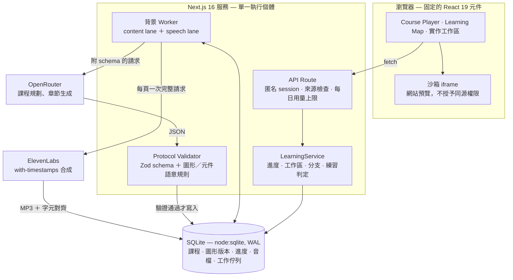

# Methelia

[English](README.md) | **繁體中文**

輸入一句話——_「我想自己做出一個個人網站」_——Methelia 就為它規劃一門課：一張有學習依賴的節點圖，每一章在你走到之前才整章生成，逐頁講解，而且練習沒真的通過就不讓你往下走。

真正有意思的限制是模型**不能**做的事：**它一行介面程式碼都不會寫。**

## 問題與目標

現有的學習素材只有兩種，而且對「有明確目標的人」都不好用。

錄好的線上課程是固定的。兩年前有人決定了大綱，你要嘛剛好想學那個，要嘛不是。聊天機器人剛好相反——它什麼都答得出來，但回給你的是一整段文字：沒有順序、沒有可以動手的東西、也沒有人確認你到底學會了沒。你讀完一段 CSS 權重的解釋，點點頭，關掉分頁，什麼都沒留下。

看起來最省事的解法是讓模型連教學介面一起生成。那是拿一個問題換一個更糟的：每一堂課都變成一坨沒測過的 markup，「Terminal」是個道具，練習檢查是模型當天心情的產物，而你等於在一個作業系統裡開了任意程式執行的洞。

Methelia 從另一邊切：**模型只規劃與撰寫，不負責呈現。** 它輸出的是結構化 JSON——先是一張帶真正前置關係的 Course Graph，然後一次一整章，包含分頁內容、示範、題目、練習完成條件與旁白腳本。學習者碰到的每一個東西——編輯器、Terminal、預覽、地圖、播放器——都是我們自己寫好也測過的固定 React 元件。練習有沒有通過，由後端去看實際存下來的檔案系統，不採信模型，也不採信瀏覽器說「我做完了」。

整個賭注就是這件事：課程內容可以是任何主題，但練習仍然可被驗證、執行仍然有邊界。

## 核心功能

- **目標變成一張圖，不是播放清單。** 規劃器輸出帶前置條件的學習節點與一條排好序的路徑。Learning Map 把它畫出來，可全螢幕、可拖曳縮放，也可以回頭進入任何已完成的節點而不會弄丟你現在的進度。
- **章節整章生成，而且是即時準備。** 章節不會在你邊看的時候一句一句吐給你。所有分頁、範例、檢查點與整份旁白腳本，都在你看到第一頁之前就生成並驗證完畢，而且在你上這一章的期間結構不再改變。
- **字幕是對齊出來的，不是估出來的。** 每一頁以一次 with-timestamps 請求送給 ElevenLabs，短句字幕從回傳的字元對齊時間切出來。對齊與原文對不上時直接顯示錯誤，不捏造時間。播完停在當頁，不會硬拖著你往前。
- **實作環境是真的。** 左邊即時預覽、右邊教學 Terminal，`edit index.html` 開啟編輯器，打字時預覽同步重繪。檔案存在 SQLite，完成的網站可以整包 ZIP 匯出。
- **老師會示範，但不會幫你寫作業。** 示範區塊是在一份隔離的檔案副本上重播一段預先驗證過的 find/replace 並展示結果。你自己的作品完全沒被動到，接下來的練習還是得你自己做。
- **練習驗收在伺服器端。** `file.includes`、`file.exists`、`directory.exists`、`cwd.equals` 或答對題目——每一種都由後端對照存下來的狀態判定。前端送一個「我完成了」過來不會有任何效果。
- **問問題，就多繞一段路。** Help Drawer 可以針對你剛卡住的地方推薦補強節點。你會先看到它教什麼、在哪裡接回主線，確認之後才會生效——而且是把圖分出一個新的不可變版本，不是覆蓋掉你原本的路徑。

## 系統架構



整個系統就是一個 Next.js 程序加一個背景 worker，用 `concurrently -k` 一起啟動，共用同一個 SQLite 檔案。沒有 Redis、沒有 Postgres、沒有佇列服務、沒有第二台機器——工作佇列就是一張資料表。這讓部署維持在一個付費執行個體、一顆要備份的磁碟，也讓 `npm run dev` 就能在筆電上跑起完整的系統。

有五件事值得說明：

**耗時的事情都不在請求裡做。** HTTP handler 只負責驗證、寫入、排入佇列。規劃一門課或合成旁白要幾十秒，所以交給 worker，UI 用輪詢等結果。連線中斷不會弄丟已經生成好的東西。

**Validator 是唯一的入口。** 模型輸出先過 Zod schema，再過 [`src/core/protocol.ts`](src/core/protocol.ts) 裡的語意規則：圖必須無環且每個節點都可達、前置節點必須真的排在它前面、元件必須是該版型允許的、練習區塊必須附可驗證的檢查點、示範用的 `find` 字串必須真的出現在它宣稱要改的那個檔案裡、Terminal 指令必須是執行端跑得動的。不通過就退回去修，最多兩次，絕不會讓半合法的內容進到學習者面前。

**兩條 lane，同一個佇列。** 內容生成與語音合成從同一張 `generation_jobs` 表分兩條 lane 取工作，所以一個很慢的 TTS 請求不會擋住下一章的準備。每個工作取 240 秒的 lease、30 秒送一次 heartbeat，worker 中途被砍掉時工作會被釋放，而不是永遠卡在那裡。

**晚到的寫入會輸。** 每次提交都在自己的交易裡重新確認：現在要寫的這一章，仍然是這門課的現役版本。使用者完全可能在供應商請求還在路上時就刪掉課程或重建語音；等回應終於回來，結果會被丟棄，而不是把已刪除的資料復活。[刪除測試](tests/worker-deletion.test.ts) 就是為了這個情境存在的。

**學習者的程式碼離主機很遠。** 網站預覽是沒有同源權限的沙箱 iframe，CSP 擋掉外部載入。Terminal 不是 shell，而是一個跑在資料庫裡的虛擬檔案系統之上的直譯器。

大約 8,000 行 TypeScript，測試也差不多是同樣的量。

## 使用技術

| 類別         | 技術／服務                                                  | 用途                                                       |
| ------------ | ----------------------------------------------------------- | ---------------------------------------------------------- |
| AI 模型      | OpenRouter · `z-ai/glm-5.3-flash`                           | 規劃 Course Graph、生成整章 Chapter Package（結構化 JSON） |
| 前端         | Next.js 16（App Router）、React 19、TypeScript 7            | 課程播放器、Learning Map、實作工作區等所有固定元件         |
| 後端         | Next.js Route Handler（Node.js 22）、Zod 4                  | API、匿名 session、Protocol 驗證與練習判定                 |
| 後端         | 自建背景 worker（tsx ＋ concurrently）                      | 內容與語音兩條 lane 的持久化生成佇列                       |
| 資料庫       | `node:sqlite`（WAL）                                        | 課程、圖形版本、進度、工作區、音檔、每日用量               |
| Sponsor 技術 | **ElevenLabs**（`eleven_multilingual_v2`、with-timestamps） | 逐頁語音合成與字元級字幕對齊                               |
| 部署         | Render Blueprint ＋ 持久化磁碟                              | 單一服務同時執行網站與 worker                              |
| 測試         | Vitest 5、Playwright                                        | 核心／服務／worker 單元測試與瀏覽器回歸測試                |

## 安裝與執行

需要 **Node.js 22.17 或更新版本**——SQLite 用的是 Node 內建的 `node:sqlite`，這個版本會顯示 experimental warning。

```bash
git clone https://github.com/Jack-hehe/methelia.git
cd methelia
git switch feat/methelia-mvp-release
npm ci

# 填入 AI_BASE_URL / AI_MODEL / AI_API_KEY
# 與 ELEVENLABS_API_KEY / ELEVENLABS_VOICE_ID
cp .env.example .env.local

# 同時啟動 Next.js 與背景 worker，Ctrl+C 一起停止
npm run dev
```

開啟 <http://127.0.0.1:3000>。**不用 API key 也能試**——點「Try a Lesson／先體驗一堂課」就會進入預先做好的示範課程；要生成新課程與語音才需要憑證。

```bash
npm test && npm run typecheck && npm run build
npx playwright install chromium && npm run test:e2e
```

Windows PowerShell 請改用 `npm.cmd`／`npx.cmd`，並用 `Copy-Item .env.example .env.local`。憑證設定、語音生成規則與 Render 部署步驟見 [docs/operations.md](docs/operations.md)。

## 作品展示

- 作品展示網址：_待補_（Render 部署，HTTP Basic 保護，帳號 `demo`）
- 評選影片：_待補_

## 限制與未來工作

寫在這裡，免得有人在展示途中才發現。

- **Terminal 是有真實狀態的教學介面，不是 shell。** `pwd`、`ls`、`cd`、`mkdir`、`touch`、`cat`、`clear` 操作的是一個會存下來的虛擬檔案系統。沒有參數旗標、管線、重新導向、套件安裝或行程。`python -m http.server 8000` 是接到預覽的轉接器，不會執行 Python。
- **預覽沙箱沒有資源配額。** iframe 沒有同源權限，CSP 擋掉外部載入，但沒有東西擋得住 `while (true)`。不要把這一版當成公開的任意程式執行服務。
- **沒有帳號。** Session 就是一個 cookie。清掉之後那些課程就找不回來，目前沒有救援機制。
- **只有一條路徑，不是排程器。** 補強節點是串進單一主線的。任意多分支的課程編排還沒實作。
- **語音只同步到 Section。** 區塊內的引導游標是按固定相對進度前進，不是逐字語意對齊；也還沒有老師形象與口型同步。
- **測試過不代表內容過。** 示範課程有端到端測試覆蓋，但那不能說明一個剛生成出來、主題任意的章節在教學上是否正確——那還是得有人真的讀過。
- **用量上限算的是次數，不是金額。** 每個 UTC 日 100 次 AI 請求、30,000 個語音字元，由 SQLite 原子計數。供應商仍然照模型與 token 另外計費。

接下來大致的順序：

- **學科無關（進行中，在開發分支上）。** 每個節點顯式宣告自己的 Learning Environment——`none`、`web`、`python` 或 `terminal`——讓概念型主題不必為了證明學會而被硬套成做一個網站。同時會帶進瀏覽器內的 Pyodide Python 環境與可列印的講義匯出。設計見[通用課程架構](docs/superpowers/specs/2026-09-05-general-learning-architecture-design.md)。
- 會員登入與跨裝置的進度同步。
- 引導游標的逐字語意對齊，讓示範跟著句子走而不是跟著時鐘走。
- 多分支課程排程，以及對生成章節更嚴格的驗收流程。

## 第三方服務、資料與素材

| 項目                | 來源                                                                                                   | 使用方式與授權                                                                     |
| ------------------- | ------------------------------------------------------------------------------------------------------ | ---------------------------------------------------------------------------------- |
| ElevenLabs TTS      | [with-timestamps API](https://elevenlabs.io/docs/api-reference/text-to-speech/convert-with-timestamps) | 依帳號訂閱方案呼叫，逐頁合成旁白與字幕；金鑰只存在 `.env.local` 與 Render 環境變數 |
| OpenRouter          | <https://openrouter.ai>                                                                                | 模型代理服務，依其服務條款與各模型供應商規範使用                                   |
| Next.js / React     | <https://nextjs.org> · <https://react.dev>                                                             | MIT                                                                                |
| Zod                 | <https://zod.dev>                                                                                      | MIT                                                                                |
| lucide-react        | <https://lucide.dev>                                                                                   | ISC                                                                                |
| fflate              | <https://github.com/101arrowz/fflate>                                                                  | MIT——作品 ZIP 匯出                                                                 |
| Vitest / Playwright | <https://vitest.dev> · <https://playwright.dev>                                                        | MIT／Apache-2.0，僅開發相依                                                        |
| Render              | <https://render.com>                                                                                   | 付費 Web Service 與持久化磁碟，依其服務條款                                        |
| 課程內容            | 由模型於執行時生成                                                                                     | 未使用任何外部教材資料集或受版權保護的課程內容                                     |
| 字型                | 系統字型（`system-ui`、Noto Sans TC 等）                                                               | 未內嵌或散布第三方字型檔                                                           |
| 音訊                | 旁白由 ElevenLabs 合成；測試使用專案自建的靜音 WAV                                                     | 未使用第三方錄音素材                                                               |

金鑰與個人資料不進版控：`.env.local`、`.data/` 與測試輸出都在 `.gitignore` 裡，`.env.example` 只有空白欄位。

## 團隊成員

| 姓名     | 分工   |
| -------- | ------ |
| Jack     | _待補_ |
| Casanova | _待補_ |

## License

MIT，完整條款見 [LICENSE](LICENSE)。
