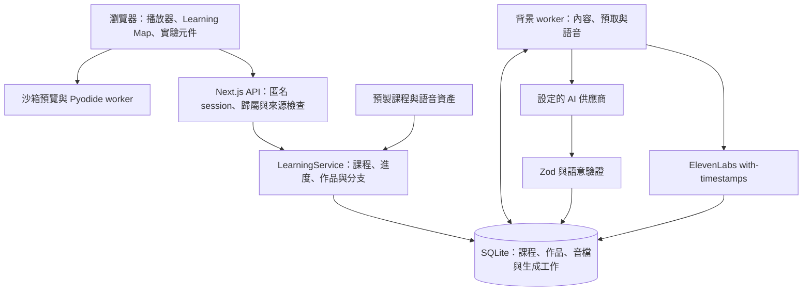

# Methelia

[English](README.md) | **繁體中文** · **[開啟 Methelia](https://methelia.com)**

Methelia 把學習目標變成一套結合理解與實作的課程。精簡說明搭配視覺模型、動畫、實驗、程式實作與檢查點，讓學習者能把觀念用出來。可以直接選擇完整專題，也可以描述想學的內容，建立個人化學習路徑。

網站已公開，所有人都能免帳號、免共用密碼使用。課程與作品保存在伺服器，由瀏覽器 cookie 識別各個匿名學習者。目前尚未提供會員登入或跨裝置進度取回功能。

## 學習流程

1. **選擇專題或描述目標。** 個人化課程會依主題逐步詢問經驗、興趣與深度；支援的題目可多選或跳過，也能取消本次製作。
2. **查看 Learning Map。** 節點說明觀念、前置知識與學習成果。個人化章節逐步準備；精選專題則已備妥每堂五章的完整內容。
3. **透過操作理解。** 閱讀重點、調整模型、觀看示範，或在適合的編輯器中實作。
4. **驗證理解並調整路徑。** 題目與作品檢查提供回饋。個人化路徑在準備後續章節時會參考學習表現；延伸單元從所選節點分出支線，學完可回到主課程。

### 網站入門體驗課程

「先體驗一堂課」會開啟 **用 HTML、CSS、JavaScript 製作互動個人首頁**。五章依序介紹語言分工、修改 HTML 主標題、CSS 按鈕樣式、JavaScript 點擊事件，以及匯出完成的網站檔案。老師講解結合觀念、示範與練習指引；中英文共十個章節音檔已預製完成，兩種語言合計約 33 分鐘。開啟體驗課程不會自動付費生成缺少的音檔。詳見[核准講稿與驗證紀錄](docs/starter-course-release.md)。

### 精選專題

目前有 **20 堂專題 × 每堂 5 章**，提供**英文與繁體中文版本**：共 100 個章節、200 份在地化章節內容。200 份章節語音皆已預製完成，總長約 154 分鐘。

| 領域                | 專題                                                          |
| ------------------- | ------------------------------------------------------------- |
| 網頁、Python 與運算 | 互動作品集、Python 資料網站、文字冒險、CSV 資料故事、迷宮尋路 |
| 數學                | 2D／3D 方程探索器、平滑雲霄飛車與導數、機率遊戲               |
| 物理與聲音          | 碰撞關卡、衛星任務、可調式燈具、迷你合成器                    |
| 視覺設計            | 色彩工具、資訊層級海報、彈跳角色                              |
| 科學與環境          | 小型生態系、粒子分離、防雨社區                                |
| 經濟與邏輯          | 咖啡店經營模擬、數位邏輯門                                    |

每堂專題將背景與用途連到可操作的模型或程式，再透過實驗與題目確認理解。**17 種可重用實驗元件**支援參數保存、操作示範、重設與實驗匯出；三堂程式課程則產出能運作的程式或可下載檔案。

詳見[課程發行指南](docs/featured-courses-release.md)、[元件介面與模型限制](docs/teaching-components.md)、[各課程參考來源](src/core/featured/references.ts)。

### 播放與實作

- **整章共用一個音檔。** ElevenLabs 的字元時間對齊用來建立字幕與分頁邊界。播到分頁邊界會暫停，手動選擇下一頁或下一章則自動播放；既有逐頁語音仍相容。
- **字幕獨立覆蓋。** 字幕浮在課程上方。滑鼠閒置時播放欄隱藏，字幕仍保持可見，並留有底部間距。
- **重用 Python 執行環境。** Pyodide 在瀏覽器 worker 中執行 Python，學習介面持續掛載時會重用執行環境。產生的文字檔案可預覽並下載為 ZIP。
- **配合活動的工作區。** 網站課程使用編輯器與沙箱預覽；Terminal 操作可保存的虛擬檔案系統；純概念課程不需要程式工作區。
- **有範圍的示範與驗收。** 老師使用隔離的作品視圖或暫時的實驗控制示範。伺服器依題目答案與已保存的檔案狀態檢查宣告條件；這不等於證明任意程式都正確。

## 系統架構

模型選擇已支援的元件，提供結構化課程內容、範例與檢查條件；React 元件實作教學介面。模型產生的網站範例可以包含 HTML、CSS 與 JavaScript，但會在預覽沙箱內執行，不會直接變成平台介面程式碼。



Next.js 與背景 worker 由 `concurrently -k` 一起執行，共用 WAL 模式的 SQLite 資料庫。課程圖、章節與語音工作保存在資料庫，內容、預取與語音分別排程。前置問題與部分教學協助仍透過 API handler 呼叫模型，因此這些互動仍受供應商回應速度影響。

生成內容必須通過 schema 與語意驗證，包括圖形、前置關係、元件參數及檢查條件；不合格輸出最多進行兩次修復。Worker 寫入前會確認課程與章節版本仍有效。供應商失敗會顯示並提供重試；外部請求中斷時，仍可能無法確定是否已計費。

## Project Structure

```text
methelia/
├── src/
│   ├── app/                         # Next.js 頁面、版型與 API 路由
│   │   ├── api/[...path]/route.ts   # 課程、session、進度與作品 API
│   │   ├── api/health/route.ts      # 部署健康檢查
│   │   └── explore/page.tsx         # 課程目錄頁面
│   ├── components/                  # 播放器、Learning Map、前置問題與工作區
│   │   └── labs/                    # 可重用的互動教學實驗元件
│   ├── core/                        # 課程結構、狀態與學習邏輯
│   │   ├── featured/                # 精選課程內容與參考來源
│   │   ├── labs/                    # 模擬模型與實驗邏輯
│   │   └── starter-teaching.ts      # 中英文入門教學內容與旁白講稿
│   ├── server/                      # 資料保存、供應商串接與流程協調
│   │   ├── service.ts               # 課程生命週期、進度與作品管理
│   │   ├── worker.ts                # 背景內容與語音生成工作
│   │   ├── db.ts                    # SQLite 結構與儲存
│   │   └── speech.ts                # ElevenLabs 合成與時間對齊驗證
│   └── proxy.ts                     # 選用的私有進站限制
├── public/
│   ├── featured-audio/              # 精選課程 MP3、字幕與分頁時間
│   └── starter-audio/               # 入門課程 MP3、字幕與分頁時間
├── scripts/                         # 語音資產準備、檢查與驗證工具
├── tests/                           # Vitest 單元測試與 Playwright 瀏覽器測試
│   └── fixtures/                    # 測試課程、供應商替身與測試伺服器
├── docs/                            # 教學元件介面、操作說明與發行紀錄
│   └── course-scripts/              # 已審閱的中英文入門旁白講稿
├── .env.example                     # 本機環境設定範本
├── next.config.ts                   # Next.js 建置設定
├── render.yaml                      # Render 服務、磁碟與環境設定
└── package.json                     # 相依套件與開發指令
```

修改入門教學內容可從 [starter-teaching.ts](src/core/starter-teaching.ts) 與[審閱講稿](docs/course-scripts) 開始。互動實驗元件位於 [src/components/labs](src/components/labs)，模型邏輯位於 [src/core/labs](src/core/labs)。本機執行資料 `.data/` 與建置輸出 `.next/` 由程式產生，不納入 Git。

## 使用技術

| 層級       | 實作                                                                     |
| ---------- | ------------------------------------------------------------------------ |
| 介面       | Next.js 16 App Router、React 19、TypeScript 7、Lucide 圖示               |
| 內容與 API | Zod 4、Node.js 22、可設定的 OpenAI 相容 AI 端點；正式部署使用 OpenRouter |
| 資料保存   | 內建 `node:sqlite`、WAL、資料庫工作佇列                                  |
| Python     | Pyodide 0.28.3，由 jsDelivr 載入瀏覽器 worker                            |
| 語音       | ElevenLabs with-timestamps；正式入門與精選語音使用 `eleven_v3`           |
| 匯出       | fflate ZIP 壓縮檔、實驗 JSON                                             |
| 部署       | Render Web Service 與持久化磁碟，網站和 worker 共用單一執行個體          |
| 驗證       | Vitest、Playwright                                                       |

## 本機執行

使用 **Node.js 22.17 或更新版本**。Node 22 的內建 SQLite 模組可能顯示 experimental warning。

```bash
git clone https://github.com/Jack-hehe/methelia.git
cd methelia
npm ci
cp .env.example .env.local
npm run dev
```

開啟 [http://127.0.0.1:3000](http://127.0.0.1:3000)。PowerShell 請使用 `Copy-Item .env.example .env.local`；若執行原則擋住 `npm.ps1`，可改用 `npm.cmd`。

**精選課程內容與入門課程不需要供應商 API key。** 要生成個人化課程，請在 `.env.local` 設定 `AI_BASE_URL`、`AI_MODEL` 與 `AI_API_KEY`。使用 OpenRouter 的 `https://openrouter.ai/api/v1` 等 OpenAI 相容端點，以及支援應用程式所需結構化輸出的模型。

要合成新語音，請設定 `ELEVENLABS_API_KEY`、`ELEVENLABS_VOICE_ID` 與 `ELEVENLABS_MODEL`。範例環境預設為 `eleven_flash_v2_5`，正式入門與精選音檔使用 `eleven_v3`。預製語音快取需要相符的聲音、模型與語言設定，但命中快取不需要合成用金鑰。更換設定後需重新準備音檔；正式網站已設定好相符的配置。

```bash
# 建置並啟動本機 production 版本
npm run build
npm start
```

本機資料預設存於 `.data/`，可用 `METHELIA_DATA_DIR` 修改。Python 初始化與 Google Fonts 需要網路連線。憑證放在 Git 忽略的 `.env.local` 中。

## 驗證修改

```bash
npm test
npm run build
npx playwright install chromium
```

若要使用隔離的瀏覽器驗收環境，先建立專用的建置輸出：

```bash
# macOS / Linux
METHELIA_TEST_BUILD=1 npm run build
npx playwright test --config playwright.general.config.ts
```

```powershell
# PowerShell
$env:METHELIA_TEST_BUILD = '1'
npm run build
Remove-Item Env:METHELIA_TEST_BUILD
npx playwright test --config playwright.general.config.ts
```

這個設定使用暫存資料庫、固定回應的本機模型替身與 3100 port，實際執行 API、worker 及瀏覽器執行環境。預設的 `npm run test:e2e` 則啟動或重用 3000 port 的開發伺服器；部分隔離伺服器專用案例會在該模式下跳過。

精選課程版本於 2026-09-06 通過 294 項單元測試與 59 項選定的瀏覽器案例，200 個 MP3 全部通過解碼、字幕與分頁時間檢查。後續公開模式也驗證了匿名開課與不同訪客之間的資料隔離。這些是當時的驗證結果，不代表任意生成內容的品質保證。詳見[發行驗證紀錄與語音準備指令](docs/featured-courses-release.md)；生成語音可能消耗供應商額度。

新版入門課程另通過 87 項相關單元測試、28 項既有瀏覽器案例，以及兩項新增的中英文元素操作案例。十個入門音檔全數通過解碼與時間檢查；正式網站也已走完兩種語言的課程流程，確認快取播放、分頁暫停、練習完成與 ZIP 匯出。詳見[入門課程發行紀錄](docs/starter-course-release.md)。

## 部署與目前限制

[render.yaml](render.yaml) 將 `main` 部署到一個附持久化磁碟的 Render 服務。`METHELIA_PUBLIC_ACCESS=true` 讓網站免除選用的私有進站限制，session 歸屬與設定的來源檢查仍保持啟用。程式採手動部署，設定變更需經 Blueprint 同步流程確認。安裝、備份與用量設定見[操作說明](docs/operations.md)。

- **瀏覽器身分，尚無帳號救援。** 清除識別 cookie 後會失去該學習者課程的存取權，目前沒有跨裝置登入或救援流程。
- **教學用執行環境。** Terminal 支援有限指令，不是主機 shell。Python 在瀏覽器中執行；Python 網站課程產生靜態 HTML，不會架設 Flask 或 Django。預覽 JavaScript 沒有伺服器端資源配額，仍可能使瀏覽器執行環境卡住。
- **明確範圍的實驗模型。** 模擬只開放支援的參數，不是任意方程求解器或工程分析工具；模型假設記錄在元件說明中。
- **自適應路徑仍有範圍。** 已提供延伸支線與依表現調整的功能；任意課程排程與全自動教學品質評估仍待完成。
- **供應商與主機限制。** 新 AI 內容與未快取語音需要設定供應商。Render 設定為每個 UTC 日全站共 100 次 AI 請求與 30,000 個合成字元；播放快取音檔不消耗該合成額度。這些是用量計數，不是金額上限。

## 限制與未來工作

上面那節說明現在的執行環境能做到什麼；這一節則是 Methelia 目前還做不到、以及我們想加上去的東西。以下都沒有預定完成時間。

### 帳號

現在的學習者就只是一個瀏覽器 cookie。沒有註冊也沒有密碼，清除網站資料就會失去課程。

- 用電子郵件連結或第三方帳號登入，並保留登入前已經開始的學習內容。
- 換一台裝置也能接著上，清除瀏覽器後也能把進度找回來。
- 自己匯出或刪除自己的課程與作品。
- 教師與學生角色，可以分班並指派專題。

### 更多課程

目前有 20 個精選專題加一堂入門課程，每堂五章，只有英文與繁體中文。目錄只能挑一個領域，也沒有搜尋。

- 更多專題、更多領域，課程也可以更長。章節結構本來就允許到七章，但現在每堂都停在五章。
- 用標題與內容搜尋，並能依難度和先備知識篩選。
- 更多語言。
- 把自己的教材變成課程：丟一支影片、一份 PDF、一份簡報或一篇文章進來，就生出章節、檢核點與旁白。這個目前完全還沒有——現在的課程不是我們自己寫的，就是你打字描述目標後生成的。
- 老師自己編寫課程，以及把完成的作品發表出來。

### 更好的教學

檢核點現在只有選擇題和檔案檢查。伺服器看得出檔案對不對，但看不出你的程式寫得好不好，也看不出你用自己的話寫的解釋有沒有道理。

- 開放式作答加上模型回饋，並和自動檔案檢查分開顯示。
- 把先前的章節帶回來複習，而不是只能一直往前。
- 更多實驗元件，示範的時間也更準。
- 生成的課程在送到學習者面前之前，先做更好的品質檢查。

### 平台

一個 Render 服務和它的 worker 共用一個磁碟上的一個 SQLite 檔案，而且部署要手動觸發。

- 自動備份，而且還原真的有測過。目前的手動步驟見[操作說明](docs/operations.md)。
- 能夠跑不只一個執行個體。
- 提高供應商額度。現在整個網站每天共用 100 次 AI 請求與 30,000 個語音字元。

## 來源與致謝

- 精選課程與簡化模型位於 [src/core/featured](src/core/featured) 與 [src/core/labs](src/core/labs)；[參考清單](src/core/featured/references.ts) 收錄官方文件與開放教科書。個人化內容於執行時生成。
- ElevenLabs 提供合成旁白，OpenRouter 提供設定的模型代理服務。服務與生成輸出適用各供應商條款。
- Pyodide 資產由 jsDelivr 載入。DM Sans 與 Noto Sans TC 透過 Google Fonts 載入並提供系統字型 fallback，並非隨專案打包的字型檔。
- 相依套件各自適用其授權；本專案的 MIT 授權不取代第三方授權或服務條款。

## 團隊與授權

由 **Jack** 與 **Casanova** 製作。專案程式碼採用 [MIT](LICENSE) 授權。
