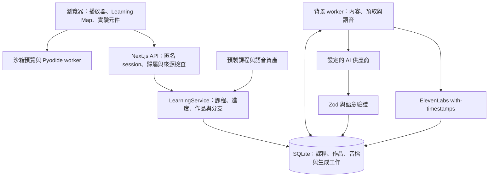

# Methelia

[English](README.md) | **繁體中文** · [網站](https://methelia.com)

**Learn anything you want — 學你想學的任何事。** Methelia 是一個 AI 學習平台，想解決的是：接收到很多資訊，卻沒有真正理解。AI 可以給出大量回答，但學習者仍需要清楚的學習順序、讓概念變得具體的例子，以及運用所學的機會。

說出你想學的主題，Methelia 會先針對該主題詢問背景與目標，再透過 Learning Map 安排課程。教學結合精要的老師講解、文字、圖解、動畫、互動模型與實作，依概念選擇適合的呈現方式。有些觀念適合用圖像說清楚，有些適合親手操作、解一道題，或透過完整專案理解。每個環節都應該幫助使用者吸收重點。

我們希望建立一個跨領域的學習環境：無論是理解數學架構、探索科學現象，還是學會從頭完成一個作品，都能找到有脈絡的學習方式。Learning Map 串起學習進度、延伸探索與後續章節的難度調整，讓使用者理解重點、建立概念之間的連結，並能運用所學。目前的實作範圍以以下支援的教學元件與練習環境為基礎。

Methelia 是持續開發中的開源專案。目前使用匿名瀏覽器 session：課程與作品保存在伺服器，由瀏覽器 cookie 識別各個學習者。你可以在本機執行，也可以自行部署。託管網站可能暫停，本機執行不依賴網站是否開放。

## 核心功能

- 依主題詢問學習背景與目標，生成個人化課程與 Learning Map，根據練習表現調整後續章節，也能延伸探索相關知識。
- 精要講解、圖解、動畫、互動模型與實作整合在同一個學習介面，依概念選擇適合的教學方式。
- 20 個精選專題課程，每堂五章，中英雙語，200 個章節旁白全部預製完成。
- 17 個可重用的互動實驗元件，涵蓋數學、物理、化學、生物、經濟與邏輯。
- 瀏覽器內的 Python 執行環境與網頁編輯／沙箱預覽工作區，完成的作品可下載成 ZIP。
- 透過題目檢查理解程度，或在支援的實作環境中驗證實際儲存的作品與程式碼。

## 使用技術

| 類別         | 技術／服務                                                 | 用途                                     |
| ------------ | ---------------------------------------------------------- | ---------------------------------------- |
| AI 模型      | 可設定的 OpenAI 相容模型 API，例如 OpenRouter | 生成課程圖、章節內容與檢查條件           |
| 語音合成     | **ElevenLabs**（`eleven_v3`，with-timestamps）             | 合成旁白，並產生字幕與分頁時間對齊       |
| 前端         | Next.js 16 App Router、React 19、TypeScript 7、Lucide 圖示 | 播放器、Learning Map 與實驗元件介面      |
| 後端         | Node.js 22、Zod 4、內建 `node:sqlite`（WAL 模式）          | API、內容驗證、生成佇列與資料保存        |
| 學習執行環境 | Pyodide 0.28.3、沙箱 iframe 預覽、fflate                   | 瀏覽器內的 Python、網頁工作區與 ZIP 匯出 |
| 部署         | Render Web Service 與持久化磁碟                            | 網站與背景 worker 共用單一執行個體       |
| 驗證         | Vitest、Playwright                                         | 單元測試與瀏覽器流程測試                 |

[render.yaml](render.yaml) 設定使用 `main` 的單一 Render 服務。目前設定關閉自動部署，push 本身不會更新正式網站，需在 Render 手動啟動部署。安裝、備份與用量設定見[操作說明](docs/operations.md)。模型透過 `AI_MODEL` 選擇，並未在程式中綁定特定供應商模型。

## 本機執行

使用 **Node.js 22.17 或更新版本**。Node 22 的內建 SQLite 模組可能顯示 experimental warning。

```bash
git clone https://github.com/Jack-hehe/methelia.git
cd methelia
npm ci
cp .env.example .env.local
npm run dev
```

開啟 [http://127.0.0.1:3000](http://127.0.0.1:3000)。PowerShell 請使用 `Copy-Item .env.example .env.local`；若執行原則擋住 `npm.ps1`，可改用 `npm.cmd`。

**精選課程內容與入門課程不需要供應商 API key。** 要生成個人化課程，請在 `.env.local` 設定 `AI_BASE_URL`、`AI_MODEL` 與 `AI_API_KEY`。使用 OpenRouter 的 `https://openrouter.ai/api/v1` 等 OpenAI 相容端點，以及支援應用程式所需結構化輸出的模型。

要合成新語音，請設定 `ELEVENLABS_API_KEY`、`ELEVENLABS_VOICE_ID` 與 `ELEVENLABS_MODEL`。範例環境預設為 `eleven_flash_v2_5`，正式入門與精選音檔使用 `eleven_v3`。預製語音快取需要相符的聲音、模型與語言設定，但命中快取不需要合成用金鑰。更換設定後需重新準備音檔，請為自己的執行環境配置相符的設定。

```bash
# 建置並啟動本機 production 版本
npm run build
npm start
```

本機資料預設存於 `.data/`，可用 `METHELIA_DATA_DIR` 修改。Python 初始化與 Google Fonts 需要網路連線。憑證放在 Git 忽略的 `.env.local` 中。

## 系統架構

模型選擇已支援的元件，提供結構化課程內容、範例與檢查條件；React 元件實作教學介面。模型產生的網站範例可以包含 HTML、CSS 與 JavaScript，但會在預覽沙箱內執行，不會直接變成平台介面程式碼。



Next.js 與背景 worker 由 `concurrently -k` 一起執行，共用 WAL 模式的 SQLite 資料庫。課程圖、章節與語音工作保存在資料庫，內容、預取與語音分別排程。前置問題與部分教學協助仍透過 API handler 呼叫模型，因此這些互動仍受供應商回應速度影響。

生成內容必須通過 schema 與語意驗證，包括圖形、前置關係、元件參數及檢查條件；不合格輸出最多進行兩次修復。Worker 寫入前會確認課程與章節版本仍有效。供應商失敗會顯示並提供重試；外部請求中斷時，仍可能無法確定是否已計費。

## 專案結構

```text
methelia/
├── src/
│   ├── app/                         # Next.js 頁面、版型與 API 路由
│   │   ├── api/[...path]/route.ts   # 課程、session、進度與作品 API
│   │   ├── api/health/route.ts      # 部署健康檢查
│   │   └── explore/page.tsx         # 課程目錄頁面
│   ├── components/                  # 播放器、Learning Map、前置問題與工作區
│   │   └── labs/                    # 可重用的互動教學實驗元件
│   ├── core/                        # 課程結構、狀態與學習邏輯
│   │   ├── featured/                # 精選課程內容與參考來源
│   │   ├── labs/                    # 模擬模型與實驗邏輯
│   │   └── starter-teaching.ts      # 中英文入門教學內容與旁白講稿
│   ├── server/                      # 資料保存、供應商串接與流程協調
│   │   ├── service.ts               # 課程生命週期、進度與作品管理
│   │   ├── worker.ts                # 背景內容與語音生成工作
│   │   ├── db.ts                    # SQLite 結構與儲存
│   │   └── speech.ts                # ElevenLabs 合成與時間對齊驗證
│   └── proxy.ts                     # 選用的私有進站限制
├── public/
│   ├── featured-audio/              # 精選課程 MP3、字幕與分頁時間
│   └── starter-audio/               # 入門課程 MP3、字幕與分頁時間
├── scripts/                         # 語音資產準備、檢查與驗證工具
├── tests/                           # Vitest 單元測試與 Playwright 瀏覽器測試
│   └── fixtures/                    # 測試課程、供應商替身與測試伺服器
├── docs/                            # 教學元件介面、操作說明與發行紀錄
│   └── course-scripts/              # 已審閱的中英文入門旁白講稿
├── .env.example                     # 本機環境設定範本
├── next.config.ts                   # Next.js 建置設定
├── render.yaml                      # Render 服務、磁碟與環境設定
└── package.json                     # 相依套件與開發指令
```

修改入門教學內容可從 [starter-teaching.ts](src/core/starter-teaching.ts) 與[審閱講稿](docs/course-scripts) 開始。互動實驗元件位於 [src/components/labs](src/components/labs)，模型邏輯位於 [src/core/labs](src/core/labs)。本機執行資料 `.data/` 與建置輸出 `.next/` 由程式產生，不納入 Git。

## 驗證修改

```bash
npm test
npm run build
npx playwright install chromium
```

若要使用隔離的瀏覽器驗收環境，先建立專用的建置輸出：

```bash
# macOS / Linux
METHELIA_TEST_BUILD=1 npm run build
npx playwright test --config playwright.general.config.ts
```

```powershell
# PowerShell
$env:METHELIA_TEST_BUILD = '1'
npm run build
Remove-Item Env:METHELIA_TEST_BUILD
npx playwright test --config playwright.general.config.ts
```

這個設定使用暫存資料庫、固定回應的本機模型替身與 3100 port，實際執行 API、worker 及瀏覽器執行環境。預設的 `npm run test:e2e` 則啟動或重用 3000 port 的開發伺服器；部分隔離伺服器專用案例會在該模式下跳過。

各版本當時的驗證紀錄與語音準備指令，見[精選課程發行紀錄](docs/featured-courses-release.md)與[入門課程發行紀錄](docs/starter-course-release.md)。準備新語音可能消耗供應商額度。

## 限制與未來工作

- 目前沒有帳號系統。清除學習者 cookie 後，該瀏覽器會失去原有課程的存取方式，但不會因此刪除伺服器上的資料。跨裝置登入與復原機制尚未實作。
- 精選課程每堂五章；個人化課程的 Learning Map 節點數可變，目前提示通常要求 4–9 個節點，也能增加延伸單元。課程支援英文與繁體中文；目錄搜尋與更多語言仍屬未來工作。
- 課程不是我們自己寫的，就是你打字描述目標後生成的。我們也想讓你丟自己的教材進來——一支影片、一份 PDF 或一份簡報——直接變成課程。
- 檢核點只有選擇題與檔案檢查，無法判斷程式寫得好不好，也無法判斷你用自己的話寫的解釋有沒有道理。開放式作答加上模型回饋還在規劃中。
- 教師自己編寫課程、班級角色與作業指派都還不存在。
- Terminal 只支援有限指令而不是主機 shell，Python 在瀏覽器中執行，實驗元件也只開放固定參數，不是任意方程求解器。
- 儲存庫中的部署設定使用單一 `1c-2g` Render 執行個體與 1 GB 持久化磁碟，SQLite 也存放新生成的音檔。這個架構不會自動擴充；掛載持久化磁碟的服務無法擴充成多個執行個體，見 [Render 磁碟限制](https://render.com/docs/disks#disk-limitations-and-considerations)。
- AI 與語音生成使用付費外部服務。部署範本目前將應用程式的每日預算設為 `unlimited`，自行部署時請依需求設定預算；供應商額度仍然適用。用量統計、限制與備份方式見[操作說明](docs/operations.md)。
- 一個 worker 分別處理目前內容、預取與語音三條佇列，每條同時執行一個工作，多人生成時會排隊。供應商額度、CPU、記憶體、儲存空間與流量仍會限制容量，支付主機費不會移除這些限制。目前尚未透過壓力測試確認可承載的同時使用人數。

## 參與開發

歡迎一起改進學習體驗、課程內容、互動元件與系統穩定性。較大的修改請先開 issue，說明想解決的問題與做法。

- 以理解為核心：解釋概念、讓它變得具體，再提供有意義的應用機會。
- 依主題選擇文字、視覺呈現或互動，保持字體清晰，讓教學內容有足夠的畫面空間。
- 元件應能跨課程重用，並提供明確的參數與對應驗證。
- 同步維護英文與繁體中文文件及使用者介面文字。
- 修改時附上相關驗證，不要提交 API key 或學習者資料。

## 來源與致謝

- 精選課程與簡化模型位於 [src/core/featured](src/core/featured) 與 [src/core/labs](src/core/labs)；[參考清單](src/core/featured/references.ts) 收錄官方文件與開放教科書。個人化內容於執行時生成。
- ElevenLabs 提供合成旁白，OpenRouter 提供設定的模型代理服務。服務與生成輸出適用各供應商條款。
- Pyodide 資產由 jsDelivr 載入。DM Sans 與 Noto Sans TC 透過 Google Fonts 載入並提供系統字型 fallback，並非隨專案打包的字型檔。
- 相依套件各自適用其授權；本專案的 MIT 授權不取代第三方授權或服務條款。

## 團隊與授權

由 **Jack** 與 **Casanova** 製作。專案程式碼採用 [MIT](LICENSE) 授權。
